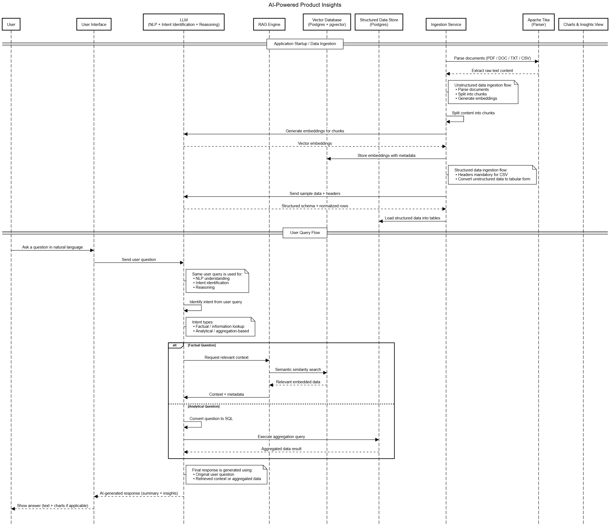

# AI Data Insights Chatbot

An intelligent RAG chatbot that answers questions about your CSV data using vector search for factual queries and SQL for analytical aggregations.

## What Does It Do?

This chatbot automatically:
1. **Classifies your question** into one of three types:
   - **FACTUAL**: "Tell me about the document created on 14/10/2025 ?" → Searches vector embeddings
   - **ANALYTICAL**: "How many files are PUBLIC?" → Runs SQL aggregations
   - **GENERAL**: "Hello!" → Casual conversation
2. **Retrieves relevant data** from the appropriate source (Vector DB or SQL DB)
3. **Generates natural language answers** using AWS Bedrock Claude 3 Sonnet

## How Does It Work?

### Architecture Overview


The system uses a dual-database approach to handle different types of queries:

```
CSV Data → Ingested into → Vector DB (embeddings) + SQL DB (structured data)
                                    ↓
User Question → Intent Classification → Route to Vector Search OR SQL Query
                                    ↓
Retrieved Data + Question → Claude 3 Sonnet → Natural Language Answer
```

### Detailed Flow



#### 1. Data Ingestion (Startup)
```
CSV File (data.csv)
  ↓
Parse CSV → Extract Headers & Rows
  ↓
  ├─→ Vector Store Path:
  │   ├─ Convert each row to text format
  │   ├─ Generate embeddings using AWS Titan
  │   └─ Store in PostgreSQL pgvector
  │
  └─→ SQL Store Path:
      ├─ Auto-generate schema from CSV headers
      ├─ Infer data types (TEXT, INTEGER, TIMESTAMP, etc.)
      ├─ Create table with proper types
      ├─ Convert date formats (DD/MM/YYYY → YYYY-MM-DD)
      └─ Batch insert all rows (configurable batch size)
  ↓
Generate Data Summary → Store in Vector DB
```

#### 2. Query Processing (Runtime)
```
User Question
  ↓
[STEP 1] Intent Classification (using Claude via prompt)
  ↓
  ├─→ FACTUAL Intent:
  │   ├─ Semantic similarity search in Vector DB
  │   ├─ Retrieve top K similar documents (default: 3)
  │   ├─ Extract relevant content from embeddings
  │   └─ Send to Claude with analytics prompt
  │
  ├─→ ANALYTICAL Intent:
  │   ├─ Generate SQL query from question (using Claude + SQL prompt)
  │   ├─ Execute query on PostgreSQL
  │   ├─ Include SQL query + column names in context
  │   └─ Send results to Claude with analytics prompt
  │
  └─→ NONE Intent (General Conversation):
      └─ Direct conversational response from Claude
  ↓
[STEP 2] Final Response Generation
  ├─ Combine question + retrieved data/SQL results
  ├─ Apply analytics-prompt.txt template
  └─ Generate natural language answer
  ↓
Return: Answer + Sources + Document Count
```

#### 3. No Data Found Flow
```
Query Returns Empty Results
  ↓
Retrieve Data Summary from Vector DB
  ↓
Generate Helpful Response:
  ├─ List available data columns
  ├─ Show sample data structure
  └─ Suggest example questions
```

**Key Features:**
- Automatic schema generation from CSV headers with type inference
- Date format conversion (DD/MM/YYYY → YYYY-MM-DD)
- Context-aware responses (includes SQL queries in analytical answers)
- Fallback to data summaries when no results found
- All prompts loaded from `.txt` files (no hardcoding)

## Why This Architecture?

- **Vector Search**: Best for finding specific records or contextual information (semantic understanding)
- **SQL Aggregations**: Best for counts, averages, statistics, and groupings (structured analysis)
- **LLM Intent Classification**: Automatically routes queries to the right system (no manual intervention)
- **Dual Storage**: Vector DB for semantic search + SQL DB for aggregations = Best of both worlds
- **No Hardcoding**: All prompts in `.txt` files, schemas auto-generated from data (flexible & maintainable)
- **Performance Optimized**: Direct SQL generation, layer caching, async loading

### Architecture Components

**Data Layer:**
- **Vector Store (pgvector)**: Stores document embeddings for semantic similarity search
- **SQL Database (PostgreSQL)**: Stores structured data for aggregations and analytics

**AI Layer:**
- **Intent Classifier**: Determines query type (FACTUAL/ANALYTICAL/NONE)
- **Embedding Model**: AWS Bedrock Titan Embed Text v1 (1536 dimensions)
- **LLM**: AWS Bedrock Claude 3 Sonnet (for SQL generation, intent classification, response generation)

**Application Layer:**
- **RagService**: Orchestrates query routing and response generation
- **IntentClassificationService**: Classifies user intent
- **AggregatedQueryService**: Handles SQL query generation and execution
- **SqlSchemaService**: Auto-generates schemas and manages data insertion
- **DataSummaryService**: Provides fallback responses when no data found

For detailed architecture diagrams, see:
- `system_architecture.png` - High-level system components
- `user_flow_diagram.png` - Detailed query processing flow

## Tech Stack

| Component | Technology |
|-----------|-----------|
| Backend | Spring Boot 3.5.10, Java 21 |
| Vector Store | PostgreSQL 16 + pgvector extension |
| Embeddings | AWS Bedrock Titan Embed Text v1 (1536D) |
| LLM | AWS Bedrock Claude 3 Sonnet |
| Container | Docker with distroless Java 21 image |
| Data Processing | Apache Commons CSV, JDBC |

## Prerequisites

- Docker & Docker Compose
- AWS Account with Bedrock access (Claude 3 Sonnet + Titan Embeddings enabled)

## Quick Start

### 1. Setup Environment

```bash
# Copy sample environment file
cp .env.example .env

# Edit .env with your AWS credentials
AWS_REGION=us-east-1
AWS_ACCESS_KEY_ID=your_key_here
AWS_SECRET_ACCESS_KEY=your_secret_here
```

### 2. Start Application

```bash
# Start all services
docker compose up -d

# Check logs
docker compose logs -f chatbot-app

# Stop services
docker compose down
```

### 3. Access

- **Chat UI**: http://localhost:8080
- **API**: `POST http://localhost:8080/api/chat`
- **Health**: `GET http://localhost:8080/api/chat/health`

## Sample Questions by Intent

### FACTUAL (Vector Search)
```
• "Tell me about the document created on 13/02/2025"
• "What is the filename in row 5?"
• "Show me details about files from Japan"
• "Which files have the INTERNAL label?"
• "What are the details of user_115's files?"
```

### ANALYTICAL (SQL Aggregation)
```
• "How many unique locations are there in the data?"
• "What is the average file size for records with the 'PUBLIC' label?"
• "Which file extension is most common for records with the 'INTERNAL' label?"
• "How many records were created in 2025 for each action type?"
• "Count of files by action type in Germany"
• "Which action (DOWNGRADED, UPGRADED, or CLASSIFIED) is most common?"
• "What is the total size of all .xlsx files?"
• "How many files were upgraded in each location?"
```

### GENERAL CONVERSATION
```
• "Hello!"
• "What can you do?"
• "How does this work?"
• "Thank you!"
```

## API Usage

### Chat Request

```bash
curl -X POST http://localhost:8080/api/chat \
  -H "Content-Type: application/json" \
  -d '{"question": "How many files are classified?"}'
```

### Response

```json
{
  "answer": "There are 20 files with CLASSIFIED action...",
  "sources": ["SQL Database: csv_data_data"],
  "documentsUsed": 1
}
```

## Configuration

### Environment Variables (.env)
- `AWS_REGION`, `AWS_ACCESS_KEY_ID`, `AWS_SECRET_ACCESS_KEY` (required)
- `CHATBOT_TOPK=3` (optional, number of similar documents to retrieve)

### Application Settings (application.yaml)
- `chatbot.sql.batch-size: 20` - Batch size for SQL inserts
- `chatbot.ingest-on-startup: true` - Load CSV data on startup
- `spring.ai.vectorstore.pgvector.remove-existing-vector-store-table: true` - Clean vector DB on startup

### Custom CSV Data
Replace `src/main/resources/docs/data.csv` with your CSV file. Schema is auto-generated from headers.

## Performance

- **Data Ingestion**: ~60 seconds for 100 rows (embedding generation time)
- **Query Response**: 2-5 seconds depending on type
- **Optimizations**:
  - Async data loading (non-blocking startup)
  - Batch SQL inserts (configurable batch size)
  - Direct SQL generation (no LLM overhead for schema/inserts)
  - Docker layer caching (dependencies cached separately)

## Project Structure

```
data_insights_chatbot/
├── .env.example              # Sample environment variables
├── compose.yaml              # Docker Compose config
├── Dockerfile                # Multi-stage build with distroless
├── pom.xml                   # Maven dependencies
├── src/main/
│   ├── java/com/yash/chatbot_rag/
│   │   ├── controller/       # REST API
│   │   ├── service/          # RAG, SQL, Intent Classification
│   │   ├── dto/              # Request/Response models
│   │   └── config/           # AWS Bedrock config
│   └── resources/
│       ├── application.yaml  # App configuration
│       ├── prompts/*.txt     # All LLM prompts
│       ├── docs/data.csv     # Your data (replaceable)
│       └── static/index.html # Chat UI
```

## Key Services

- **IntentClassificationService**: Routes queries to vector search, SQL, or conversation
- **RagService**: Orchestrates factual queries with vector similarity search
- **AggregatedQueryService**: Generates and executes SQL for analytical queries
- **SqlSchemaService**: Auto-generates schemas and inserts from CSV (with type inference)
- **DataSummaryService**: Provides helpful suggestions when no data found

## Troubleshooting

**Date Format Errors**: Automatically converted (DD/MM/YYYY → YYYY-MM-DD)

**Build Too Slow**: Layer caching implemented - dependencies only rebuild when pom.xml changes

**Data Not Loading**: Check `chatbot.ingest-on-startup: true` in application.yaml

**AWS Credentials**: Ensure `.env` file has correct credentials and Bedrock model access

---

**Built with Spring Boot 3.5, AWS Bedrock, PostgreSQL + pgvector**


